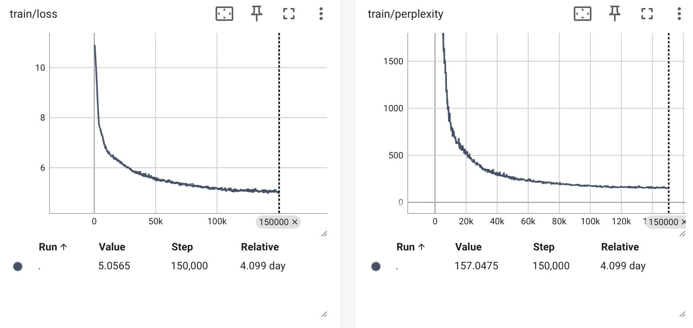
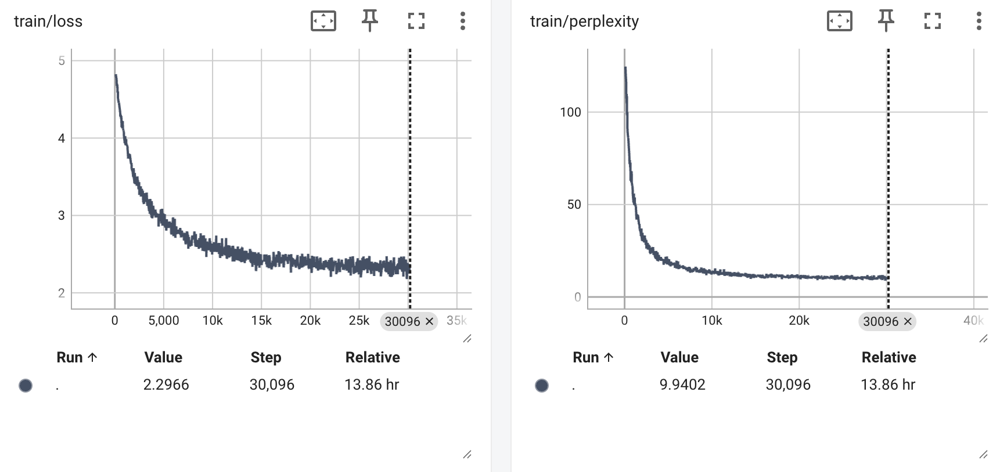

# Chefformer

## Overview
Chefformer is a 162.7M decoder transformer built from scratch and designed for recipe generation when prompted with the name of a dish. The model learned on ~461M tokens during its pretraining phase using the C4 HuggingFace dataset (far less than an industry-grade decoder, but sufficient for a personal project). The model was then finetuned on a set of ~100k recipes downloaded from 3 popular culinary platforms: Allrecipes, Epicurious, and Food Network. Finally, Chefformer cooks (pun intended) on a simple FastAPI & Streamlit UI.

## Engineering optimizations: Putting out fires in the kitchen
### Trimming the fat: Memory efficiency and lifecycle management
With a fixed 512-token context window, preventing OOM errors required extra lifecycle control over allocated memory.
* **Fire:** Retaining large intermediate tensors during the forward and backward passes quickly saturated the 24GB memory limit on the machine.
* **Extinguisher:** Explicitly `del` large tensors when no longer needed, manually invoked Python garbage collector, and continuously flushed the MPS backend (`torch.mps.empty_cache()`). Additionally, utilized gradient accumulation to maintain a stable global batch size for optimizer steps.

### Accelerating the prep: Compute and pipeline optimization
Early training iterations suffered from poor hardware utilization. The GPU frequently sat idle, like a line cook waiting for prep work.
* **Fire:** Tensorboard profiler logs revealed a 4-5+ minute optimizer step, with the GPU working a small % of the time.
* **Extinguishers:**
   - <u>Data pipeline:</u> Tuned the `Dataloader(num_workers)` parameter to provide the fastest CPU processing. Implemented a chunking strategy with 50 token overlap during pretraining, ensuring each batch is full of useful tokens instead of padding tokens. During finetuning, grouped examples by sequence length to optimize the number of padding tokens in each batch. This allowed the GPU's computation to be spent on more meaningful tokens over the course of training.
   - <u>Eliminate synchronizations:</u> Removed unnecessary device-to-host synchronizations (`.item()`, etc.) on loss tensors within the inner loop that were causing GPU to sit idle.
   - <u>Attention refactoring:</u> After writing an `AttentionHead` class from scratch, pivoted to using built-in PyTorch multihead attention logic for faster forward passes.
* **Results:** These optimizations successfully compressed the optimizer step down from over 4 minutes to just **1.5 minutes** during pretraining and **20 seconds** during finetuning.

### Adjusting the seasoning: Hyperparameter and batch architecture
Achieving a stable model convergence required a balance between global batch sizes and learning rate schedulers tailored to the phase of training (pretraining vs finetuning).
* **Fire:** Early training runs showed inefficient convergence due to learning rates that were too low or optimizer steps that were too sparse.
* **Extinguisher:** Learning rate and gradient accumulation scaled appropriately for each phase of training (larger for pretraining, smaller for finetuning), ensuring each step taken by the optimizer is meaningful and maintaining a reasonable total training time.

## Training process
Training was conducted in two distinct phases on a single local machine using the MPS (Metal Performance Shaders) backend.

### Pretraining
The goal was to establish a base of "Common Sense" English.
* **Dataset:** C4 (Colossal Clean Crawled Corpus).
* **Example metrics:** The model achieved the following pretraining validation metrics, indicating a basic grasp of English syntax before seeing a single recipe.
   - CrossEntropy Loss: `4.918`
   - Perplexity: `136.7`

  

### Finetuning
The model was shifted to the culinary domain, learning the specific structural constraints of a recipe (e.g., ingredients appearing before instructions).
* **Dataset:** ~100k curated recipes (Allrecipes, Food Network, Epicurious).
* **Example metrics:** Loss converged significantly faster here than in pretraining, as the model was mostly learning "form" rather than "language."
   - CrossEntropy Loss: `2.200`
   - Perplexity: `9.024`

  

## User Interface
Chefformer features a **FastAPI** backend for inference and a **Streamlit** frontend for user interaction. See the example demonstration below! Note that the model has not seen enough pretrain tokens to write advanced recipes, but the general recipe format and sentence topic remains intact.

  

## Enhancements
* Scaling pretraining into the billions of tokens to allow the model the proper token budget to learn advanced semantic English understanding and reasoning.
* Separation of environments & CI/CD workflow using GitHub Actions.

## Usage
1. Clone the repository
   - `git clone https://github.com/michalekb11/Chefformer.git`
   - `cd Chefformer`
2. Set up a virtual environment (optional but recommended)
   - `python -m venv venv && source venv/bin/activate` # On Windows: `venv\Scripts\activate`
3. Install dependencies
   - `pip install -e ".[test]"`
4. Add your model checkpoint
   - Place your trained model file (e.g., `epoch2_step30000.pth`) in the `checkpoints/finetune` directory.
5. Start the API
   - `make start-api`
6. Start the UI
   - `make start-ui`
7. Get cooking! Type in the name of a dish you would like to make to generate a recipe.
